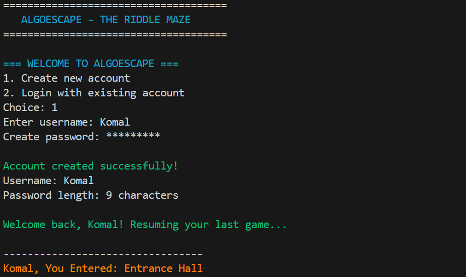
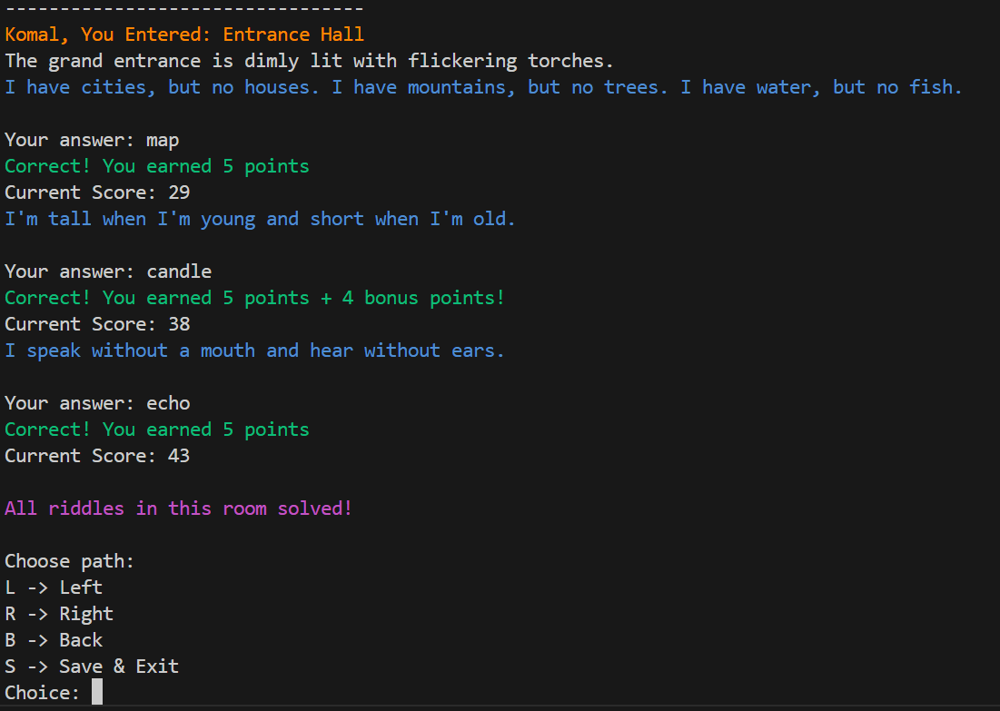
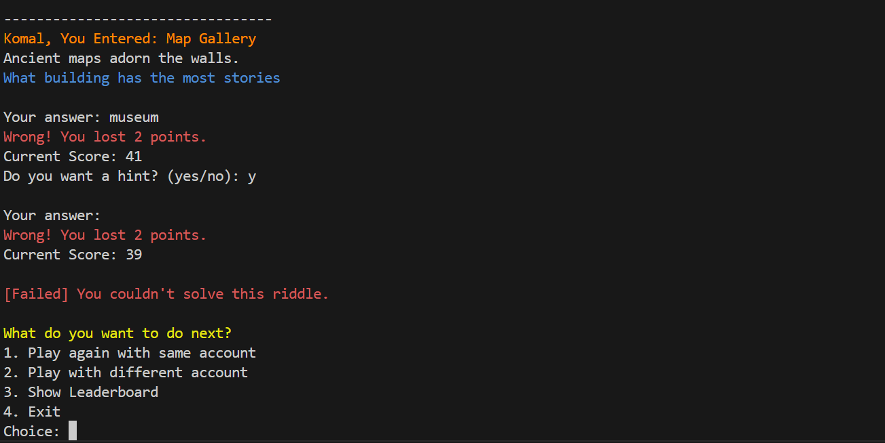
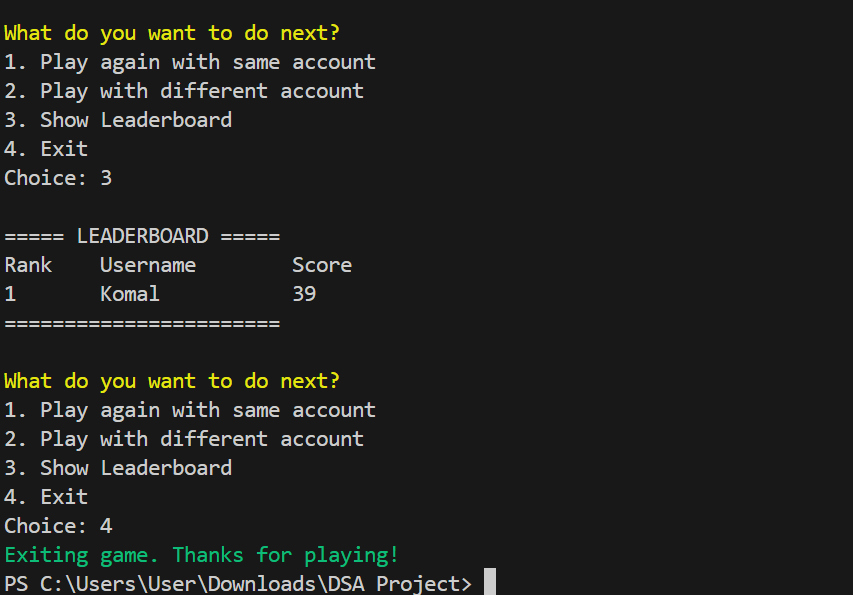

# 🎮 AlgoEscape – The Riddle Maze

> A C++ console-based adventure game that combines fun gameplay with fundamental **Data Structures and Algorithms (DSA)** concepts.


---

## 📖 Overview

AlgoEscape is an educational console game where players solve riddles, navigate through interconnected rooms, and escape a mysterious maze.

Unlike a traditional console game, AlgoEscape demonstrates real-world implementation of several Data Structures and Algorithms while providing an engaging gameplay experience.

Players can:

- 🔐 Create an account or login
- 🧩 Solve riddles
- 💾 Save and resume progress
- 🏆 Compete on the leaderboard
- ⭐ Earn bonus points for fast answers
- 💡 Use hints strategically
- 🔙 Backtrack through previously visited rooms

---

# 🎯 Features

- 👤 User Authentication System
- 🔒 Hidden Password Input
- 💾 Save & Resume Game
- 🏆 Leaderboard
- 🎲 Randomized Riddle Order
- ⭐ Time-Based Bonus Scoring
- 💡 Hint System
- 🔙 Backtracking using Stack
- 📂 File Handling
- 🌳 Multi-Room Maze Navigation
- 🎨 Colored Console Interface

---

# 🧠 Data Structures & Algorithms Used

| Concept | Implementation |
|---------|----------------|
| Vector | Stores riddles, hints and answers |
| Stack | Backtracking between rooms |
| Graph-like Navigation | Connected maze rooms |
| Sorting | Leaderboard ranking |
| Searching | Login validation & answer checking |
| Randomization | Shuffle riddles |
| File Handling | Save games & leaderboard |
| String Manipulation | User input processing |
| Time Complexity | Bonus scoring using timers |

---

# 🏰 Game Flow

```text
                 Entrance Hall
                 /            \
                /              \
       Candle Chamber      Map Gallery
          /      \           /      \
         /        \         /        \
 Fire Tunnel   Escape   Trap Room  Fire Tunnel
       \                       /
        \                     /
         ------ Escape -------
```

---

# 🎮 Gameplay

1. Create an account or login.
2. Enter the maze.
3. Solve riddles.
4. Earn points.
5. Use hints wisely.
6. Navigate left or right.
7. Backtrack if needed.
8. Escape the maze.

---

# 🏆 Scoring System

| Action | Points |
|---------|-------:|
| Correct Answer | +5 |
| Speed Bonus | Up to +10 |
| Wrong Answer | -2 |
| Hint Used | -1 |

---

# 📁 Project Structure

```
AlgoEscape/
│
├── AlgoEscape.cpp
├── leaderboard.txt
├── users.txt
├── username_save.txt
├── README.md
├── LICENSE
└── .gitignore
```

---

# 🛠 Technologies Used

- C++
- STL (Vector, Stack, Algorithm)
- File Handling
- Object-Oriented Programming
- Console Application
- Visual Studio

---

# 🚀 How to Run

### Clone the repository

```bash
git clone https://github.com/Komal-Sharafat-518/AlgoEscape-DSA-Game.git
```

### Open

Open the project in Visual Studio.

### Build

Compile using the C++ compiler.

### Run

Start the application and enjoy escaping the maze!

---

# 📚 Learning Outcomes

This project demonstrates practical implementation of:

- Data Structures
- Algorithms
- Object-Oriented Programming
- File Handling
- Problem Solving
- Console Game Development
- User Authentication
- Game State Management

---

# 📸 Screenshots





---

# 🔮 Future Improvements

- 🎵 Background music
- 🖥 GUI version
- More rooms
- More DSA challenges
- Difficulty levels
- Achievements
- Multiplayer mode
- Better save system

---

# 👩‍💻 Author

**Komal Sharafat**

Building projects while learning C++, DSA, AI Agents, and Modern Web Development.
GitHub:  https://github.com/Komal-Sharafat-518

---

## ⭐ Support

If you enjoyed this project, consider giving it a ⭐ on GitHub.
=======
# AlgoEscape-DSA-Game
A C++ console-based adventure game that demonstrates core Data Structures and Algorithms concepts through interactive gameplay.
>>>>>>> dd32d59afa55c351cfd011d432b29fe3003ff60e
